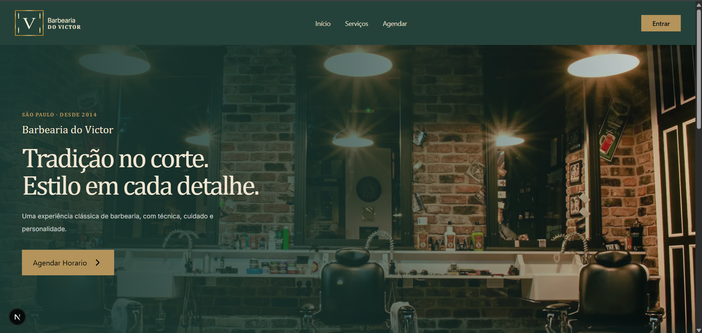
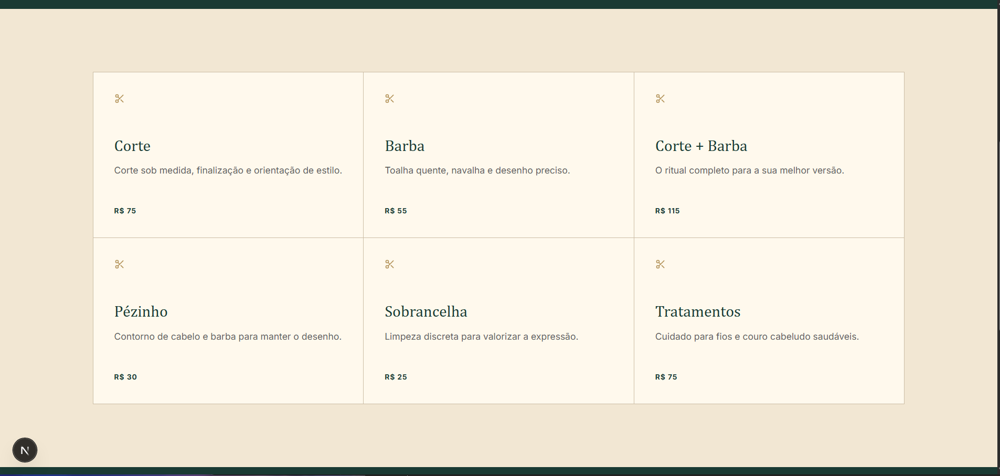
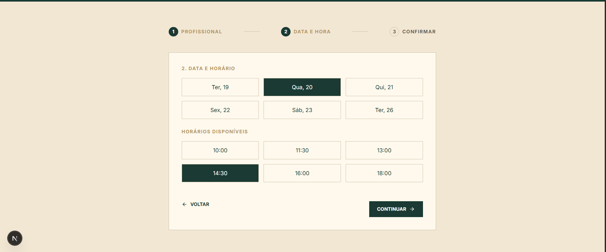
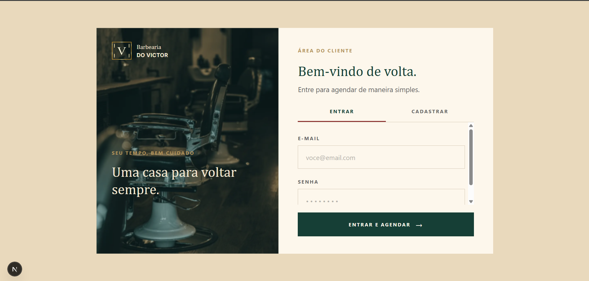

# Barbearia do Victor

Site institucional e de agendamento para a Barbearia do Victor, desenvolvido como projeto final aplicando Next.js, React, TypeScript e Tailwind CSS no frontend, com Strapi como backend headless CMS.

## 📁 Estrutura do repositório

Este é um monorepo com duas pastas principais:

```
Web-Site-Barber-Projeto-Final/
├── web-barber/       # Frontend — Next.js + React + TypeScript + Tailwind CSS
└── backend-barber/   # Backend — Strapi (CMS headless)
```

## ✨ Sobre o projeto

O frontend foi construído traduzindo, seção por seção, um design completo do Figma para componentes React reutilizáveis, com foco em fidelidade visual, responsividade e boas práticas de acessibilidade semântica (hierarquia de headings, `alt` em imagens, estados de foco). O backend usa **Strapi** para gerenciar o conteúdo dinâmico do site (serviços, barbeiros, horários e agendamentos) através de uma API REST/GraphQL.

## 🖼️ Screenshots


| Home                            | Serviços                                |
| ------------------------------- | --------------------------------------- |
|  |  |

| Agendamento                              | Login                             |
| ---------------------------------------- | --------------------------------- |
|  |  |

## 🚀 Tecnologias

**Frontend (`web-barber/`)**

- **[Next.js](https://nextjs.org/)** — framework React com App Router
- **[React](https://react.dev/)** — biblioteca de interface
- **[TypeScript](https://www.typescriptlang.org/)** — tipagem estática
- **[Tailwind CSS v4](https://tailwindcss.com/)** — estilização utilitária
- **[Lucide React](https://lucide.dev/)** — ícones

\*\*Backend(`backend-barber/`)\*\*

- **[JavaScript](https://developer.mozilla.org/en-US/docs/Web/JavaScript)** — Linguagem utilizada no desenvolvimento do backend
- **[Node.js](https://nodejs.org/)** — Runtime JavaScript utilizado para executar a aplicação
- **[Strapi v4](https://strapi.io/)** — Framework/CMS headless utilizado para criação da API REST
- **SQLite** — Banco de dados utilizado para armazenamento das informações
- **REST API + JSON** — Comunicação entre o frontend e o backend
- **Node.js v20.20.0** — Versão utilizada no desenvolvimento

## 📄 Páginas do frontend

| Rota        | Descrição                                                                   |
| ----------- | --------------------------------------------------------------------------- |
| `/`         | Home — Hero, seção "Sobre", "Vantagens para membros"                        |
| `/servicos` | Grid de serviços com descrição e preço                                      |
| `/agenda`   | Wizard de agendamento em 3 passos (profissional, data/horário, confirmação) |
| `/login`    | Autenticação de clientes                                                    |

## 🎨 Identidade visual

Definida via design tokens no `globals.css` (Tailwind v4, bloco `@theme`):

```css
--color-brand-dark: #1a3a33;
--color-brand-cream: #f2e7d3;
--color-brand-cream-light: #fff9ed;
--color-brand-gold: #b4945b;
--color-brand-black: #171717;
--color-brand-border: #cbbda5;
--font-body: Inter;
--font-heading: Cambria;
```

## 🧩 Funcionalidades

- **Layout responsivo** com breakpoints mobile-first em todas as seções
- **Menu mobile** em drawer lateral com overlay desfocado (`useState`)
- **Wizard de agendamento** com seleção interativa de profissional, data e horário (`useState`, renderização condicional)
- **Componentes reutilizáveis**: Header, Footer, cards de serviço
- **Backend headless (Strapi)** para gerenciamento de conteúdo (serviços, barbeiros, agendamentos)

## 🛠️ Rodando localmente

### Frontend

```bash
cd web-barber
npm install
npm run dev
```

Abra [http://localhost:3000](http://localhost:3000) no navegador.

### Backend

```bash
cd backend-barber
npm install
npm run develop
```

O painel administrativo do Strapi fica disponível em [http://localhost:1337/admin](http://localhost:1337/admin).

## 👥 Contribuidores

| Avatar                                                    | Nome                     | GitHub                                         |
| --------------------------------------------------------- | ------------------------ | ---------------------------------------------- |
| | Jonny Marcus Santos Militão | [@JonnyMarcus](https://github.com/JonnyMarcus) |
|| Ana Cristina Meira | [@anacmeira](https://github.com/anacmeira)       |
|| Matheus Gouveia David |[@mtgvdavid](https://github.com/mtgvdavid)       |
|| Enzo Murmo Cardoso | [@stykus74](https://github.com/stykus74)       |


## 📜 Licença

Projeto desenvolvido para fins acadêmicos e como projeto da byron.solutions — Empresa Júnior.
